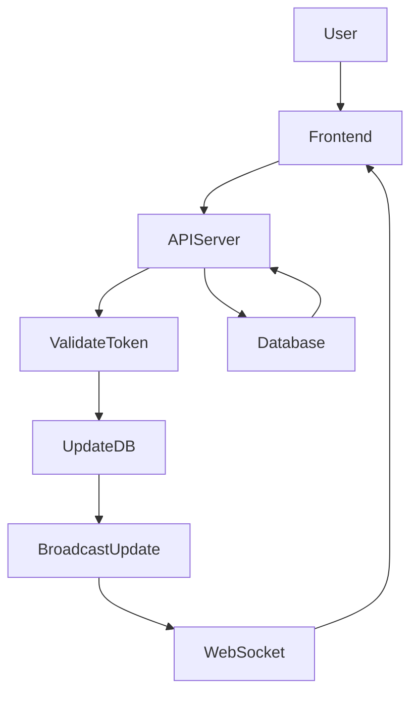

# Scoreboard API - Live Updating System

## Overview

This API module provides functionality for updating and retrieving the top 10 users on a live scoreboard. The system ensures real-time updates and prevents unauthorized score manipulation.

## Features

- **Real-time scoreboard updates** using WebSockets.
- **Secure API endpoints** for updating user scores.
- **Efficient data storage and retrieval** using PostgreSQL (via Prisma) and Redis.
- **Rate limiting and authentication** to prevent abuse.

---

## Project Structure

```
 📂 scoreboard-api
 ┣ 📂 prisma          # Prisma schema & migrations (outside src)
 ┃ ┣ 📜 schema.prisma # Prisma schema file
 ┃ ┣ 📂 migrations    # Migration history
 ┣ 📂 src            # Main application code
 ┃ ┣ 📂 config       # Environment configurations
 ┃ ┣ 📂 controllers  # Handles incoming requests
 ┃ ┣ 📂 middleware   # Middleware for authentication & security
 ┃ ┣ 📂 models       # Defines TypeScript models
 ┃ ┣ 📂 routes       # API route definitions
 ┃ ┣ 📂 services     # Business logic (CRUD operations)
 ┃ ┣ 📂 types        # Defines TypeScript types
 ┃ ┣ 📂 websockets   # Handles WebSocket connections
 ┃ ┣ 📜 app.ts       # Express application setup
 ┃ ┣ 📜 index.ts     # Main entry point
 ┣ 📜 .env           # Environment variables
 ┣ 📜 package.json   # Project dependencies
 ┣ 📜 tsconfig.json  # TypeScript config
 ┗ 📜 README.md      # Project documentation
```

---

## Database Schema (Prisma + PostgreSQL)

```prisma
model User {
  id    String  @id @default(uuid())
  name  String
  score Int     @default(0)
  createdAt DateTime @default(now())
  updatedAt DateTime @updatedAt
}
```

---

## API Endpoints

### 1. Update User Score

**Endpoint:** `POST /api/scores/update`

**Description:** Updates the user's score when an action is completed.

**Request:**

Headers:

```json
{
  "Authorization": "Bearer <auth_token>"
}
```

Body:

```json
{
  "user_id": "string",
  "score": "number"
}
```

**Response:**

```json
{
  "success": true,
  "message": "Score updated successfully",
  "new_score": 1500
}
```

**Security Measures:**

- Requires **JWT authentication**.
- Implements **HMAC signature verification** to prevent tampering.
- Uses **rate limiting** to prevent spam.

---

### 2. Get Top 10 Scores

**Endpoint:** `GET /api/scores/top10`

**Description:** Fetches the top 10 users with the highest scores.

**Response:**

```json
{
  "success": true,
  "message": "Top 10 scores retrieved successfully",
  "top_scores": [
    { "user_id": "user_1", "score": 2000 },
    { "user_id": "user_2", "score": 1800 },
    { "user_id": "user_3", "score": 1750 }
  ]
}
```

---

## Real-Time Updates

To push updates to clients, the system uses **WebSockets**:

1. **Client emits an event** when a user completes an action.
2. **Server updates the score in the database** and broadcasts the new leaderboard.
3. Clients **receive updates** without needing to refresh.

## Authentication Middleware

### (`middleware/authMiddleware.ts`)

```typescript
import { Socket } from "socket.io";
import { Request, Response, NextFunction } from "express";
import jwt from "jsonwebtoken";

const verifyToken = (token: string) => {
  if (!token) throw new Error("No token provided");
  return jwt.verify(token, process.env.JWT_SECRET!);
};

export const authenticateSocket = (
  socket: Socket,
  next: (err?: Error) => void
) => {
  try {
    const token = socket.handshake.auth.token;
    const decoded = verifyToken(token);
    (socket as any).user = decoded;
    next();
  } catch (err) {
    next(new Error("Authentication error"));
  }
};

export const authenticateAPI = (
  req: Request,
  res: Response,
  next: NextFunction
) => {
  try {
    const authHeader = req.headers.authorization;
    if (!authHeader || !authHeader.startsWith("Bearer ")) {
      return res.status(401).json({ message: "Unauthorized" });
    }

    const token = authHeader.split(" ")[1];
    const decoded = verifyToken(token);
    (req as any).user = decoded;
    next();
  } catch (err) {
    res.status(401).json({ message: "Invalid token" });
  }
};
```

### WebSocket Implementation with Security

**Server-Side (TypeScript + WebSocket + Prisma)**

```typescript
import { Server } from "socket.io";
import { PrismaClient } from "@prisma/client";
import { authenticateSocket } from "../middleware/authMiddleware";

const io = new Server({ cors: { origin: "*" } });
const prisma = new PrismaClient();

io.use(authenticateSocket);

io.on("connection", (socket) => {
  console.log("New client connected", socket.id);

  socket.on("update_score", async (data) => {
    const { user_id, score } = data;

    // Update the score in the database
    await prisma.user.update({
      where: { id: user_id },
      data: { score: { increment: score } },
    });

    // Fetch updated top scores
    const topScores = await prisma.user.findMany({
      orderBy: { score: "desc" },
      take: 10,
    });

    // Broadcast updated scores
    io.emit("score_update", topScores);
  });

  socket.on("disconnect", () => {
    console.log("Client disconnected", socket.id);
  });
});

export default io;
```

**Client-Side (JavaScript WebSocket Client)**

```javascript
const socket = io("http://localhost:3000", {
  auth: { token: localStorage.getItem("auth_token") },
});

socket.on("connect", () => {
  console.log("Connected to WebSocket server");
});

function performAction(userId, score) {
  socket.emit("update_score", { user_id: userId, score: score });
}

socket.on("score_update", (data) => {
  console.log("Updated scores:", data);
  updateScoreboardUI(data);
});

socket.on("disconnect", () => {
  console.log("Disconnected from server");
});
```

---

## Data Storage

- **Redis**: Used to store the leaderboard for fast access.
- **PostgreSQL (via Prisma)**: Stores permanent score records and user details.

---

## Security & Anti-Cheating Measures

- **Authentication**: JWT for API requests.
- **Request Validation**: Verify user identity using HMAC signatures.
- **Rate Limiting**: Prevents API abuse with a limit of 5 updates per minute.
- **Audit Logging**: Tracks suspicious activity for further investigation.

---

## Execution Flow Diagram



---

## Future Improvements

- Implement **AI-based fraud detection** for abnormal scoring patterns.
- Introduce **leaderboard categories** (daily, weekly, all-time top scores).
- Optimize database queries for handling large-scale traffic.

---
